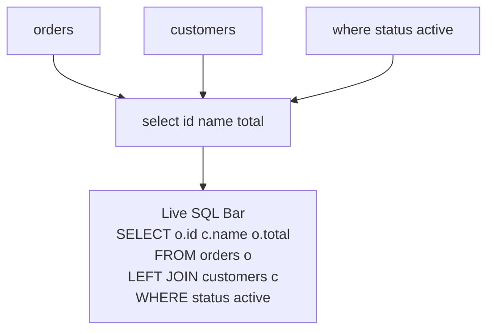
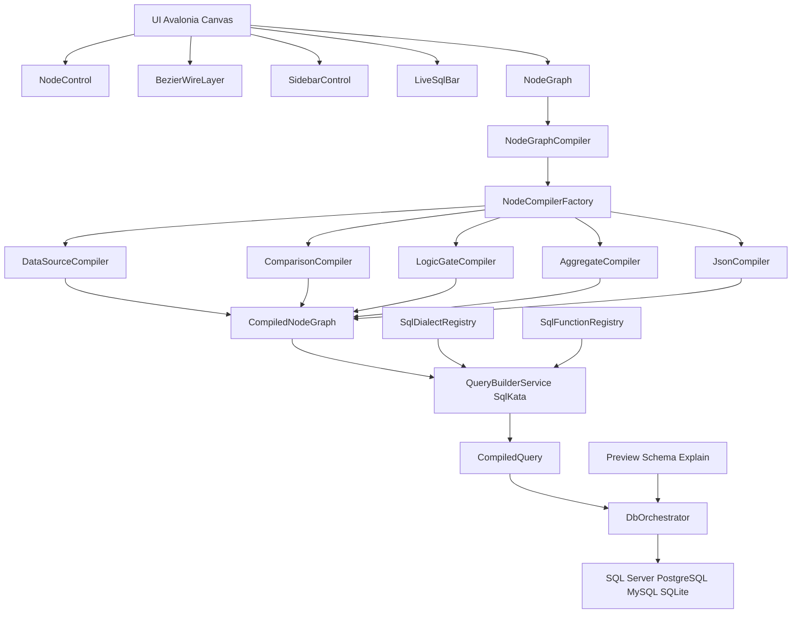

<div align="center">

# DBWeaver

**Crie consultas SQL visualmente - sem precisar digitar.**

Um designer SQL baseado em nós e canvas infinito que compila para SQL real e parametrizado em SQL Server, PostgreSQL, MySQL e SQLite.

[](https://github.com/TheyCallMeErick/VisualSqlArchtect/actions/workflows/ci.yml)
[](https://github.com/TheyCallMeErick/VisualSqlArchtect/releases)
[](https://dotnet.microsoft.com)
[](https://avaloniaui.net)

</div>

---

<a id="pt-br"></a>
<a id="english"></a>

**Idioma / Language:** 🇧🇷 [Português (PT-BR)](#pt-br) · 🇺🇸 [English](#english)

**Status / Backlog:** [PROJECT_BACKLOG.md](PROJECT_BACKLOG.md)

## O que é?

O DBWeaver permite arrastar nós para o canvas e conectá-los para montar consultas SQL. Cada conexão vira um JOIN, cada nó de filtro vira uma cláusula WHERE, e o resultado aparece instantaneamente como SQL ao vivo abaixo do canvas - sem digitação, sem erros de sintaxe e sem dor de cabeça com dialetos.

Diagrama visual do fluxo (query por nós): veja [Diagramas compartilhados](#shared-diagrams).

---

## Funcionalidades

### Canvas
- **Pan e zoom infinitos** - pan com botão do meio, zoom com scroll e atalhos de teclado
- **Nós por arrastar e soltar** - paleta de busca com fuzzy find e fluxo keyboard-first
- **Conexões por fios** - curvas Bézier com validação em tempo real e pinos com checagem de tipo
- **Multi-seleção e alinhamento** - selecione, mova, exclua e alinhe grupos de nós
- **Auto-layout** - um clique para organizar um grafo bagunçado em uma árvore limpa
- **Desfazer / refazer** - pilha de comandos granular, Ctrl+Z / Ctrl+Y
- **Salvar / carregar sessões** - persistência do canvas em JSON e do workspace (query + DDL)

### Geração de SQL
- **Pré-visualização SQL em tempo real** - cada edição atualiza a barra de SQL instantaneamente
- **Multi-dialeto** - SQL Server, PostgreSQL, MySQL e SQLite
- **Preview seguro** - `ExecutePreviewAsync` sempre faz rollback; nunca altera dados
- **Plano EXPLAIN** - um clique para visualizar o plano de execução retornado pelo servidor
- **Importador SQL** - cole SQL existente e importe de volta como grafo de nós

### Biblioteca de nós

| Categoria | Nós |
|---|---|
| **Fonte de dados** | Tabela, Raw SQL |
| **Comparação** | =, ≠, >, ≥, <, ≤, BETWEEN, LIKE, IS NULL |
| **Portas lógicas** | AND, OR, NOT |
| **Agregações** | SUM, COUNT, AVG, MIN, MAX, COUNT DISTINCT |
| **Matemática** | +, −, ×, ÷, ROUND, ABS, MOD, POWER |
| **String** | UPPER, LOWER, TRIM, LENGTH, CONCAT, REPLACE, SUBSTRING, REGEX |
| **Condicionais** | CASE WHEN, IIF / COALESCE |
| **JSON** | JSON Extract, JSON Value, JSON Array Length |
| **Tipos** | CAST / CONVERT |
| **Modificadores de resultado** | ORDER BY, LIMIT / TOP, DISTINCT, GROUP BY, HAVING |

### Sistema de tipos de pino

Cada pino tem **forma + cor** que identificam o que ele carrega. Forma indica a família semântica; cor indica o tipo específico.

| Família | Forma | Tipos | Cor |
|---|---|---|---|
| Escalar | Círculo `●` | Text, Integer, Decimal, Boolean, DateTime, Json | Azul · Verde · Âmbar · Ciano · Índigo |
| Referência de coluna | Losango `◆` | ColumnRef | Laranja |
| Lista de colunas | Losango vazado `◇` | ColumnSet | Ouro |
| Conjunto de linhas | Losango achatado `⬥` | RowSet | Rosa |
| SQL bruto | Círculo tracejado `○` | Expression | Cinza |

Pinos incompatíveis ficam apagados durante o drag. Vermelho é reservado para erros de validação estática (pino obrigatório sem conexão).

Referência completa: [docs/PIN_TYPES_REFERENCE.md](docs/PIN_TYPES_REFERENCE.md)

---

### Integração com banco de dados
- **Gerenciador de conexões** - salve e nomeie múltiplas conexões, com teste em um clique
- **Fluxo de conexão com confirmação** - ao conectar, você pode manter o canvas atual ou limpá-lo antes de carregar o novo contexto de banco
- **Explorador de schema** - navegue por schemas, tabelas e colunas em árvore lateral
- **Carregamento automático de tabelas** - ao conectar com sucesso, os metadados são carregados e as tabelas ficam disponíveis imediatamente no menu de busca
- **Detecção automática de joins** - detecta relacionamentos FK e convenções de nome (`orders.customer_id -> customers.id`) e sugere o join correto
- **Biblioteca de templates de consulta** - salve e carregue snippets reutilizáveis de grafos

### Ferramentas para desenvolvimento
- **Painel de diagnóstico** - memória em tempo real, FPS e estado da conexão
- **Overlay de benchmark** - mede tempo de renderização e compilação
- **Suíte automatizada de testes** - compiladores de nós, emissão por dialeto, heurísticas de metadados e segurança de ciclo de vida/UX

### Atualizações recentes
- **Hardening do preview SQL** - o SQL de preview evita placeholders bound no caminho de execução que exige SQL literal-safe
- **Sincronização segura de provider** - o provider do Live SQL é sincronizado com o provider da conexão ativa para evitar erros entre dialetos
- **Consistência de UX em modais** - diálogos de overlay podem ser fechados por clique no backdrop e com `Esc`

---

## Download

Baixe o binário self-contained mais recente em [Releases](https://github.com/TheyCallMeErick/VisualSqlArchtect/releases) - sem necessidade de instalar .NET.

| Plataforma | Binário |
|---|---|
| Windows x64 | `xe` |
| Linux x64 | `` |
| macOS x64 | `|

---

## Compilar do código-fonte

**Pré-requisitos:** [.NET 9 SDK](https://dotnet.microsoft.com/download/dotnet/9.0)

```bash
git clone https://github.com/TheyCallMeErick/VisualSqlArchtect.git
cd VisualSqlArchtect

# Executar a aplicação
dotnet run --project src/xecutar a suíte de testes
dotnet test files.sln
```

---

## Arquitetura

Diagrama de arquitetura: veja [Diagramas compartilhados](#shared-diagrams).

---

## Estrutura do projeto

Diagrama da estrutura do projeto: veja [Diagramas compartilhados](#shared-diagrams).

---

## Contribuição

1. Faça um fork do repositório
2. Crie uma branch de feature a partir de `main`
3. Execute `dotnet test files.sln` - todos os testes devem passar
4. Abra um pull request

O pipeline de CI roda em todo PR; o pipeline de release publica binários automaticamente quando uma tag `v*` é enviada.

---

## English

### What is it?

DBWeaver is a node-based SQL designer with an infinite canvas. You connect nodes to compose queries visually: connections become JOINs, filter nodes become WHERE clauses, and the generated SQL is shown live below the canvas.

### Features

#### Canvas
- **Infinite pan & zoom** - middle-mouse pan, scroll-wheel zoom, keyboard shortcuts
- **Drag-and-drop nodes** - searchable palette with fuzzy find and keyboard-first workflow
- **Wired connections** - bezier curves with live validation and type-checked pins
- **Multi-select & align** - move, delete and align node groups
- **Auto-layout** - one-click graph organization
- **Undo / redo** - granular command stack (`Ctrl+Z` / `Ctrl+Y`)
- **Save / load sessions** - JSON canvas persistence and workspace persistence (query + DDL)

#### SQL Generation
- **Real-time SQL preview** - updates instantly as the graph changes
- **Multi-dialect** - SQL Server, PostgreSQL, MySQL and SQLite
- **Safe previews** - `ExecutePreviewAsync` always rolls back (no data mutations)
- **EXPLAIN plan** - visualize execution plans returned by the database
- **SQL importer** - paste SQL and rebuild it as a node graph

#### Pin type system

Every pin has a **shape + color** that communicates what it carries. Shape encodes the semantic family; color encodes the specific type.

| Family | Shape | Types | Color |
|---|---|---|---|
| Scalar | Circle `●` | Text, Integer, Decimal, Boolean, DateTime, Json | Blue · Green · Amber · Cyan · Indigo |
| Column reference | Diamond `◆` | ColumnRef | Orange |
| Column list | Hollow diamond `◇` | ColumnSet | Gold |
| Row set | Flat diamond `⬥` | RowSet | Pink |
| Raw SQL | Dashed circle `○` | Expression | Gray |

Incompatible pins fade out during drag. Red is reserved for static validation errors (required pin with no connection).

Full reference: [docs/PIN_TYPES_REFERENCE.md](docs/PIN_TYPES_REFERENCE.md)

---

#### Database Integration
- **Connection manager** - store and test multiple connections quickly
- **Connect confirmation flow** - choose whether to keep or clear the current canvas when connecting
- **Schema explorer** - browse schemas, tables and columns
- **Automatic table loading** - metadata loads on connect and tables become immediately available in search
- **Auto-join detection** - infers relationships from FK metadata and naming conventions
- **Query template library** - save reusable graph snippets

#### Developer Tooling
- **Diagnostics panel** - memory, FPS and connection state
- **Benchmark overlay** - render/compile timing insights
- **Automated tests** - coverage for node compilation, dialect emission, metadata heuristics and lifecycle/UX safety

#### Recent updates
- **Preview SQL hardening** - avoids bound placeholders on literal-safe preview execution paths
- **Provider synchronization** - Live SQL provider now follows the active connection provider to prevent cross-dialect issues
- **Modal UX consistency** - overlay dialogs close via backdrop click and `Esc`

### Download

Get the latest self-contained binaries from [Releases](https://github.com/TheyCallMeErick/VisualSqlArchtect/releases).

| Platform | Binary |
|---|---|
| Windows x64 | `xe` |
| Linux x64 | `` |
| macOS x64 | `|

### Build from source

**Prerequisites:** [.NET 9 SDK](https://dotnet.microsoft.com/download/dotnet/9.0)

```bash
git clone https://github.com/TheyCallMeErick/VisualSqlArchtect.git
cd VisualSqlArchtect

# Run the app
dotnet run --project src/un tests
dotnet test files.sln
```

### Architecture

The architecture and project-structure diagrams are shared for both languages below: [Shared Diagrams](#shared-diagrams).

### Contributing

1. Fork the repository
2. Create a feature branch from `main`
3. Run `dotnet test files.sln` (all tests must pass)
4. Open a pull request

CI runs on every PR, and the release pipeline publishes binaries automatically for `v*` tags.

---

<a id="shared-diagrams"></a>

## Diagramas compartilhados / Shared diagrams

### Fluxo visual de query / Visual query flow



### Arquitetura / Architecture



### Estrutura do projeto / Project structure

```mermaid
flowchart TD
    ROOT[VisualSqlArchtect]

    ROOT --> SRC[src]
    ROOT --> TESTS[tests]

    SRC --> CORE[  SRC --> UI[  CORE --> NODES[Nodes]
    CORE --> EXPR[Expressions]
    CORE --> META[Metadata]
    CORE --> PROV[Providers]
    CORE --> QE[QueryEngine]
    CORE --> REG[Registry]

    UI --> CONTROLS[Controls]
    UI --> VMS[ViewModels]
    UI --> SERVICES[Services]
    UI --> SERIAL[Serialization]

    TESTS --> TESTPROJ[``

---

<div align="center">
Construído com Avalonia UI · .NET 9 · SqlKata
Built with Avalonia UI · .NET 9 · SqlKata
</div>
